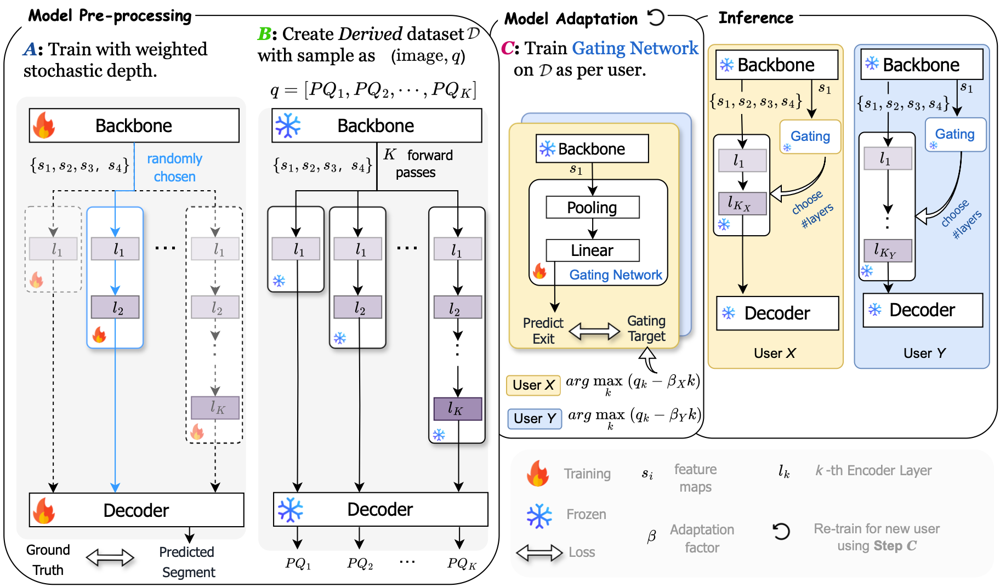

# Efficient Transformer Encoders for Mask2Former-style models


<div align="center">
<div>
    <a href='https://gyeow.github.io/' target='_blank'>Manyi Yao</a>&emsp;
    <a href='https://abhishekaich27.github.io/' target='_blank'>Abhishek Aich</a>&emsp;
    <a href='https://yuminsuh.github.io/' target='_blank'>Yumin Suh</a>&emsp;
    <a href='https://vcg.ece.ucr.edu/amit'>Amit K. Roy-Chowdhury</a>&emsp;
    <a href='https://www.cs.ucr.edu/~cshelton/' target='_blank'>Christian Shelton</a>&emsp;
    <a href='https://cseweb.ucsd.edu/~mkchandraker/' target='_blank'>Manmohan Chandraker</a>&emsp;
</div>
<div>
    <a href='https://www.nec-labs.com/' target='_blank'>NEC Laboratories, America</a> <br>
</div>
<div>
    <h4 align="center">
        <a href="https://arxiv.org/" target='_blank'>
        
        </a>
    </h4>
</div>
</div>

<!-- [[arXiv]()] -->

## Key Features
Efficient encoder design to reduce computational cost of Mask2Former-style models.
- **Dynamic.** Early exits tailored to each image.
- **Versatility.** Extends beyond segmentation to detection tasks.
- **Adaptability.** Tailored to various computational budgets.


## Model Framework

<div>
    <h4 align="center">
        
    </h4>
</div>

## Installation
- Our project is developed on Detectron2. Please follow the [official installation instructions](https://github.com/facebookresearch/detectron2/blob/main/INSTALL.md), or the following instructions.
```bash
# create new environment
conda create -n eco_m2f python=3.8
conda activate eco_m2f

# install pytorch
conda install pytorch==2.0.1 torchvision==0.15.2 torchaudio==2.0.2 cudatoolkit=11.1 -c pytorch

# install Detectron2 from a local clone
git clone https://github.com/facebookresearch/detectron2.git
python -m pip install -e detectron2
```

## Datasets

Follows the same structure as [Mask2Former](https://github.com/facebookresearch/Mask2Former/blob/main/datasets/README.md).

## Evaluation with pretrained weights
```bash
python test_net.py --num-gpus 1 \
    --config-file PATH_TO_CONFIG.yaml \
    MODEL.WEIGHTS PATH_TO_CHECKPOINT.pth \
    SOLVER.IMS_PER_BATCH 1

```

## Model Zoo
### Results on COCO
|   Backbone  |   Configs   |   PQ  |   mIoU    |   AP  |  Total GLOPs |   Download    |
|-------------|-------------|-------|-----------|-------|--------------|---------------|
|   SWIN-T    |[$\beta=0.0005$](./configs/00302.yaml) |52.06|   62.76   | 41.51 |     202.39    |   [model](https://drive.google.com/file/d/1XFEBSMgnWHYVdNF7w5Zo6HbeSWIfc5fG/view?usp=drive_link)   |
|   SWIN-T    |[$\beta=0.0005$](./configs/00297.yaml) |50.79|   62.25   | 39.71 |     181.64    |   [model](https://drive.google.com/file/d/1z3r9tzZIUXqQ_cOPiXiR83VAg6QjWJ44/view?usp=drive_link)   |


### Results on Cityscapes
|   Backbone  |   Configs   |   PQ  |   mIoU    |   AP  |  Total GLOPs |   Download    |
|-------------|-------------|-------|-----------|-------|--------------|---------------|
|   SWIN-T    |[$\beta=0.003$](./configs/00308.yaml) |64.18|    80.49|  39.64|    507.51    |   [model](https://drive.google.com/file/d/1AZxFyGTz4pFZuchSmTK7Dj2sHLNHz9Ve/view?usp=drive_link)   |
|   SWIN-T    |[$\beta=0.01$](./configs/00284.yaml) |62.09  |   79.58   |  36.04   | 439.67    |   [model](https://drive.google.com/file/d/1FAJ0s5VpL-YJB97_TENrvoXQU5v_V40H/view?usp=drive_link)   |

## Contact
If you have any questions, please feel free to reach me out at `aaich@nec-labs.com`. 


## Acknowledgement

Code is largely based on [Mask2Former](https://github.com/facebookresearch/Mask2Former). We thank and acknowledge their effort.


## Citing ECO-M2F
If you find our work helpful for your research, please consider citing the following BibTeX entry.

```BibTeX
@article{

}
```